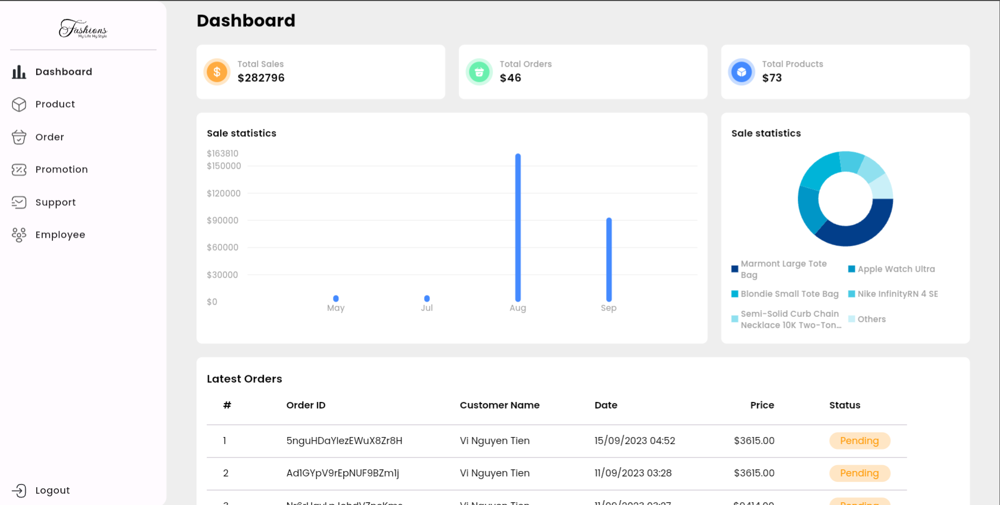

# Admin E-commerce App

## Getting Started
This Admin E-commerce App provides a platform for shop management, including features such as analysis, order management, product management,... It utilizes modern technologies for efficient performance and a user-friendly interface. The application is designed to be easy to navigate, providing users with seamless shop management. The README file includes detailed information on how to install, run, and contribute to the project



## Features
1. Analytics
2. Product management
3. Order management
6. Promotion management
7. Support (Chat, audio, video call,...)
8. Employee management

## Installation
1. Clone the repo
   ```sh
   git clone https://github.com/vinguyen1907/Admin-Ecommerce-App
   ```
2. Get packages
   ```sh
   flutter pub get
   ```
4. Run the project
   ```sh
   flutter run
   ```

## Contributors
* [Nguyễn Tiến Vĩ](https://github.com/vinguyen1907)
* [Nguyễn Tuấn Khôi](https://github.com/iawtk2302)

## Others
Customer App: https://github.com/iawtk2302/Ecommerce-App
